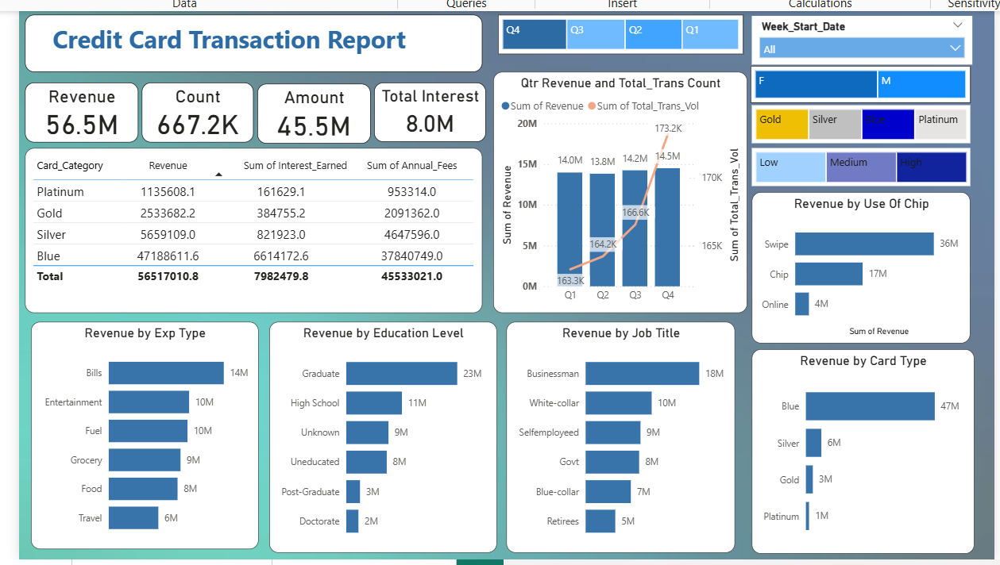
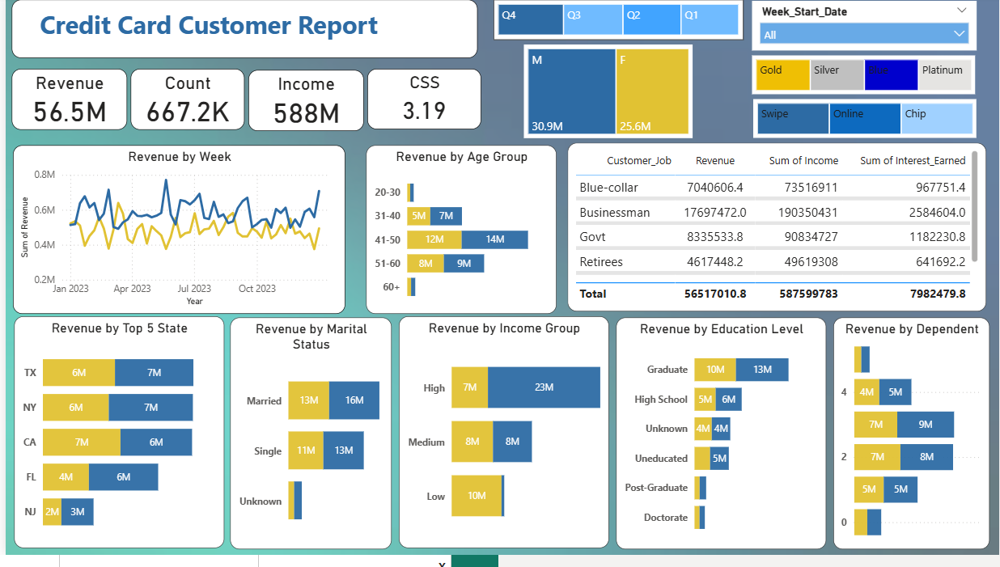

# Credit Card Finance Dashboard

A Power BI dashboard analyzing credit card transactions and customer data.

## Tools Used
- Power BI Desktop
- Power Query & DAX
## Key Insights
- Total revenue, transaction volume and customer trends tracked weekly
- Customer segmentation by age, income and card category
- Delinquency and activation rates monitored across quarters  
## Files
- `Finance_Dashboard.pbix` — Main Power BI file
- `credit_card_1_.csv` — Transaction data
- `customer_.csv` — Customer data
- `customer.png` — Customer dashboard screenshot
- `credit_card.png` — Credit card dashboard screenshot

## Dashboard Preview

### Credit Card Dashboard

### Customer Dashboard

